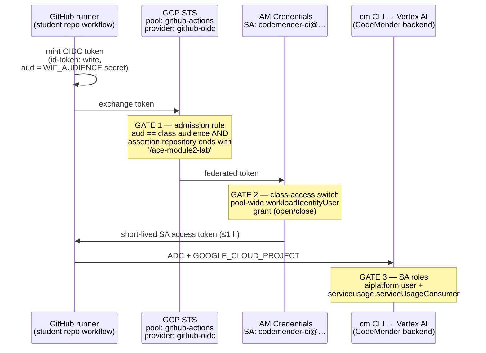

# Design: Keyless CI Authentication for the CodeMender Lab

**Status:** Shipped (2026-08-11) · **Owner:** course infrastructure · **Applies to:** `ace-module2-lab` and student copies

## Summary

The lab's CI pipeline authenticates to Google Cloud with **Workload Identity
Federation (WIF)** instead of a distributed service-account key. Each workflow
run exchanges a short-lived GitHub OIDC token — cryptographic proof of *which
repository* is running — for temporary credentials of one shared CI service
account. Admission is by **fixed repo name** (`ace-module2-lab`) **plus a
class-shared audience string** the provider requires in the token's `aud`
claim, behind a one-command open/close switch the course team flips around
each cohort. **No long-lived credential exists anywhere in the design** —
the audience is a static shared passphrase, not a credential: alone it grants
nothing (a correctly-named repo must still mint a GitHub-attested OIDC token),
and revoking it is one `gcloud` command, not a key rotation.

Proven end-to-end against the live CodeMender backend by
[`wif-auth-test.yml`](../.github/workflows/wif-auth-test.yml)
(run `31460585633`: OIDC exchange → SA impersonation → `cm init` → real
1-file scan, all green).

## Problem

CodeMender (`cm` 0.2.0) authenticates **only** via Application Default
Credentials and bills usage to `GOOGLE_CLOUD_PROJECT`. Running it in student
CI collides with five constraints:

- **C1** — Students' sandbox roles cannot create service accounts, keys, or
  WIF pools (and Argolis blocks SA key creation by org policy anyway).
- **C2** — Nobody can set a secret on a GitHub repo they don't administer,
  so with personal-account student repos the instructor cannot inject a key.
- **C3** — GitHub secrets are write-only against *reading*, but anyone with
  repo write access can exfiltrate one from a workflow (base64 sidesteps log
  masking). A shared key distributed to N student repos is effectively public
  to the class.
- **C4** — Per-student credentials multiply the instructor's provisioning and
  rotation burden by N, and sandbox lifetimes churn.
- **C5** — The lab must stay debuggable by one instructor: shared quota
  dashboard, uniform failure modes.
- **C6** — The CodeMender backend is **allow-listed per GCP project**: only
  pre-approved projects can call it. Whatever project absorbs the usage must
  be one of those — which structurally excludes ephemeral or per-student
  projects.

## Options considered

| Option | Verdict | Why |
|---|---|---|
| Shared SA key in each repo's secrets (previous design) | **Retired** | Violates C2 (personal repos) and C3 (exfiltratable); requires post-course rotation |
| GitHub org-level secret | Rejected | Only works for org/Classroom repos (C2); still a long-lived key (C3) |
| Per-student SA keys | Rejected | C1 blocks key minting; C4 burden |
| Org-level IAM binding for one SA | Rejected | Widens blast radius to every project in the GCP org; sandbox instructors rarely hold org admin; solves nothing about distribution |
| **WIF, shared project (chosen)** | **Shipped** | No secret at all → students self-serve on any repo type; fixed-name admission with open/close switch; one quota project (C5); satisfies C6 by construction |
| WIF, per-student projects | Infeasible | Blocked by C6 — per-student projects can't be allow-listed at scale. (Would otherwise offer the best isolation and per-student billing.) |

## Architecture

**Fixed-name admission + audience + kill switch.** There is no per-student
roster. Gate 1 has two factors: the provider condition
(`assertion.repository.endsWith('/ace-module2-lab')`) and the provider's
**allowed audience** — a static pre-generated string, distributed only via
the gated lab page, that each repo stores as the `WIF_AUDIENCE` secret and
the workflow requests as the OIDC token's `aud` claim. Gate 2 is a single
pool-wide `workloadIdentityUser` grant that `lab/wif-class-access.sh`
toggles — `open` before a cohort, `close` after. While open, admission
requires *both* the fixed repo name (free to anyone) and the audience value
(enrolled students only); the remaining residual — a student sharing the
string — is accepted deliberately (see Security analysis) in exchange for
zero per-student operations.

### Components

| Component | Value | Created by |
|---|---|---|
| Workload identity pool | `github-actions` (project `elevate-cm-01-rt9xt4`, #755556523613) | `lab/setup-wif.sh` |
| OIDC provider | `github-oidc`, issuer `token.actions.githubusercontent.com`, maps `google.subject`, `attribute.repository`, `attribute.repository_owner` | `lab/setup-wif.sh` |
| CI service account | `codemender-ci@elevate-cm-01-rt9xt4.iam.gserviceaccount.com` with `roles/aiplatform.user` + `roles/serviceusage.serviceUsageConsumer` (project-scoped; the first does **not** imply the second) | INSTRUCTOR.md §2a |
| Class-access grant | pool-wide `principalSet://…/workloadIdentityPools/github-actions/*` → `workloadIdentityUser` (present = open, absent = closed) | `lab/wif-class-access.sh open\|close` |
| Class audience | static string in the provider's `--allowed-audiences`; distributed only via the gated lab page; rotate = one `gcloud … update-oidc` | instructor (INSTRUCTOR.md §2c) |
| Repo variables | `GCP_WIF_PROVIDER`, `GCP_SA_EMAIL`, `GCP_QUOTA_PROJECT` — plain config, identical class-wide, **not secrets** | students (or `lab/provision-student-repos.sh`) |
| Repo secret | `WIF_AUDIENCE` — the class audience; masked in public logs | students (or `lab/provision-student-repos.sh -a`) |
| Pipeline auth | `google-github-actions/auth@v2` with `workload_identity_provider:` + `service_account:` + `project_id:` + `audience:`; job permission `id-token: write` | `codemender-pipeline.yml` |
| `cm` binary | vendored at `lab/bin/cm-linux` (Releases don't copy on fork/template, so a release-download step broke student copies) | committed in the template |

Everything is project-scoped. No org-level IAM exists in this design
(workload identity pools are project resources; org-level "workforce pools"
are an unrelated product).

## Security analysis

| Threat | Outcome |
|---|---|
| Student reads the credential | Nothing to read — the three variables are public-safe config |
| Student exfiltrates from a workflow | They obtain a token that expires in ≤1 h and grants only the SA's two project-scoped roles (plus the audience string they already legitimately have) |
| Outsider names a repo `ace-module2-lab` while access is **open** | **Denied at Gate 1** — their token lacks the class audience, which lives only on the gated lab page (this closed what used to be the accepted open-window residual) |
| Enrolled student shares the audience string | **Admitted — accepted residual.** Bounded by the SA's two roles + project quota; mitigations: `close` outside lab windows, quota caps, rotate the audience (one `gcloud` command) |
| Same, while access is **closed** | Denied at Gate 2 ("unable to impersonate") — the default state between cohorts |
| Abuse during an open window | `wif-class-access.sh close` cuts everyone off in seconds; reopen when resolved |
| Residual: quota burn during open windows | Accepted — visible on one project's dashboard; the allow-listed project carries caps |

The previous design's worst case (exfiltrated key usable from anywhere,
forever, until rotated) is structurally eliminated: tokens are minted per-run,
bound to a repo identity GitHub attests, and expire in at most an hour.

## Operations

**One-time:** create SA + roles (INSTRUCTOR.md §2a) → `setup-wif.sh
<project> <owner>/ace-module2-lab`.

**Per cohort:** `wif-class-access.sh <project> open` before (prints the
three-variable class handout) → `close` after. That's the entire recurring
operation.

**Per student (self-serve):** name the repo exactly `ace-module2-lab` → set
the three repo variables + the `WIF_AUDIENCE` secret → flip workflow
permissions. Nothing to install — the `cm` binary ships in the repo. For
Classroom/org repos, `provision-student-repos.sh -a <audience>` batches the
GitHub side.

**Failure → step → fix matrix:**

| Symptom | Failing step | Fix |
|---|---|---|
| "Not set: …" (variables or WIF_AUDIENCE) | Check WIF configuration | Add the named item — variables in the Variables tab, `WIF_AUDIENCE` in the Secrets tab |
| Token exchange rejected ("invalid audience" or similar) | Authenticate to Google Cloud | `WIF_AUDIENCE` secret missing/typo'd — re-paste from the lab page |
| "unable to impersonate" | Authenticate to Google Cloud | Class access closed (`open` it), repo not named exactly `ace-module2-lab`, or provider/SA variable typo |
| "cm binary missing" | Install CodeMender CLI | Repo copy lacks `lab/bin/cm-linux` — re-copy the template fully |
| "Grant the caller … serviceUsageConsumer" | cm find/fix | SA lost its second role — re-grant per §2a |
| `RESOURCE_EXHAUSTED` | cm find/fix | Class-wide quota contention — split sections across CI projects (each gets its own `setup-wif.sh`, five minutes) |

## Migration & cleanup

The key path is fully removed from the pipeline (no `GCP_SA_KEY` reference
remains). After the first green WIF production run:

1. `gh secret delete GCP_SA_KEY --repo <owner>/<repo>` on every repo that has it.
2. `gcloud iam service-accounts keys list --iam-account=codemender-ci@…` →
   delete all user-managed keys.

## Future work

- **Quota scaling:** if a large cohort saturates the shared project, split
  sections across additional allow-listed projects (each needs its own
  `setup-wif.sh` — five minutes — plus allow-listing lead time). Per-student
  quota projects remain off the table while CodeMender access is
  allow-listed per project (C6).
- **PR-trigger gating:** `pull_request` runs from forks get no `id-token` by
  default; if PR gating is re-enabled, restrict it to same-repo branches.
